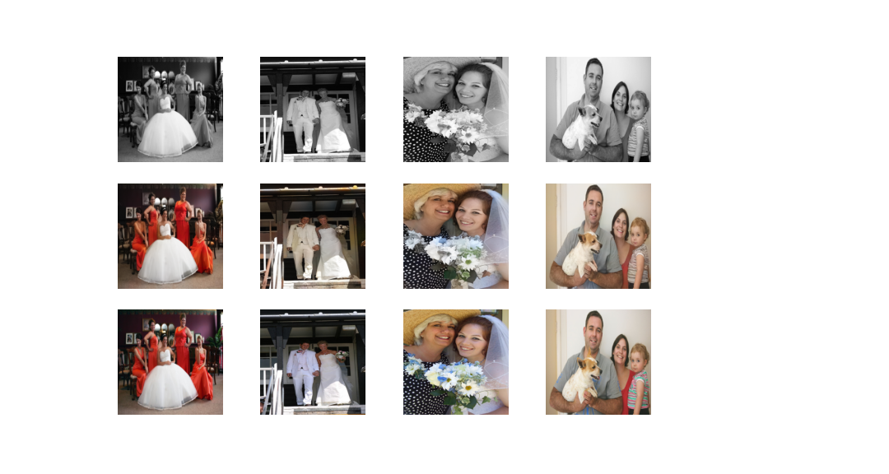

# Pix2Pix para Colorización

  <a href="README.md">English</a> |
  Español

Implementación en PyTorch de una Red Generativa Adversaria Condicional (cGAN) aplicada a la tarea de colorización de imágenes.

Se han usado las siguientes implementaciones como referencia:

-  [Pix2Pix Implementation on PyTorch. 2018](https://github.com/eriklindernoren/PyTorch-GAN/blob/master/implementations/pix2pix/pix2pix.py)
-  [Colorizing B&W Images with U-Net and conditional GAN. Moein Shariatnia. 2020](https://towardsdatascience.com/colorizing-black-white-images-with-u-net-and-conditional-gan-a-tutorial-81b2df111cd8)

## Datos

La red ha sido entrenada con 2 datasets por separado:
-   [Images of Groups](http://chenlab.ece.cornell.edu/people/Andy/ImagesOfGroups.html): Imágenes en color de retratos de grupo tomados en bodas y otros eventos sociales formales. Al ser menos muestras la red puede alcanzar resultados aceptables en menos tiempo pero generaliza peor. Apropiado para fotos familiares antiguas.
    -   4902 muestras en total (4850 para training)
-   [COCO](https://cocodataset.org/#overview): Imágenes en color variadas. Subset de [COCO Train 2017](http://images.cocodataset.org/zips/train2017.zip). Al ser más muestras y más diversas, la red generaliza mejor pero tarda mucho más en alcanzar resultados aceptables y se obtienen peores resultados para retratos familiares. Apropiada para fotos antiguas en las que aparecen animales, vehículos u otras clases incluidas en el dataset COCO.
    -   7750 muestras en total (7700 para training)

Las imágenes en escala de grises presentes en cada dataset fueron eliminadas durante el preprocesamiento.

## Preprocesamiento

Antes de entrar a la red, las imágenes son redimensionadas a 256x256, normalizadas y convertidas al espacio de color Lab.

El canal de luminancia real (L) será usado como entrada al generador y al discriminador.

Los canales de color reales (ab) serán usados para calcular el error respecto a la salida obtenida por el generador.

El generador de datos encargado de proporcionar cada batch realiza las siguientes tareas:

1.  Leer las imágenes RGB de memoria.

2.  Voltear horizontalmente aleatoriamente (data augmentation).

3.  Convertir la imagen de RGB a Lab.

4.  Normalizar los valores del canal L de \[0,100\] a \[0,1\].

5.  Normalizar los valores de los canales ab de \[-128,128\] a \[-1,1\].

6.  Convertir la matriz numpy a tensor de PyTorch (whc -> cwh). 

7.  Separar los canales de luminancia (L) y color (ab).

## Modelo

### Discriminador

La arquitectura del discriminador es [PatchGAN](https://paperswithcode.com/method/patchgan), donde la salida es una capa convolucional de 1 filtro y 15x15 dimensiones que indica cuán real es cada parche o sección de la imagen. Los autores indican PatchGAN puede entenderse como una forma de cuantificar el realismo de la textura/estilo de una imagen. De acuerdo con los autores, usar un PatchGAN de 16x16 es suficiente para obtener imágenes definidas.

La función de pérdida del discriminador es entropía cruzada con logits (BCEWithLogitsLoss).

### Generador

El generador es una U-Net donde el encoder es una ResNet18 preetrenada con ImageNet (U-ResNet). Para implementar esta red se ha utilizado la librería [FastAI](https://docs.fast.ai/).

La función de pérdida utilizada es la media del error en valor absoluto (MAE o L1 loss) entre los canales ab producidos por el generador y los canales ab de la imagen cuyo canal L se pasó como entrada al generador.

## Entrenamiento

El optimizador Adam se utilizó tanto para el discriminador como para el generador. Los parámetros utilizados son los mismos que los especificados en el artículo original [Pix2Pix](https://arxiv.org/abs/1611.07004).

Para que el entrenamiento de la GAN sea más estable partiremos de un generador que sea razonablemente bueno coloreando imagenes desde la primera epoch.

Para ello, primero se preentrena el generador de forma aislada durante 20 epochs. Después del preentrenamiento el generador es capaz de colorear imágenes.

Después, se entrena de forma conjunta el generador y el discriminador durante 100 epochs.

## Resultados

Para ambos datasets se obtienen resultados buenos para las imágenes de test. 

Sin embargo, todas las imágenes utilizadas para el entrenamiento, para ambos datasets, son imágenes nítidas sin grietas ni otros daños presentes en las imágenes antiguas. Cuando se le pasa una imagen dañada, la red no es capaz de colorearla correctamente.

Esto puede solucionarse añadiendo rayas y artefactos artificiales a la capa L de las imágenes durante el entrenamiento, modificando el generador para que produzca también el canal L y utilizando los 3 canales en la función de pérdida L1. El discriminador recibiría la versión dañada de la capa L y una imagen Lab. De este modo, la red sería capaz de colorear y también arreglar fotos antiguas dañadas.

Finalmente, se pueden obtener mejores resultados utilizando un mayor número de muestras de entrenamiento y entrenando durante más epochs, especialmente para el dataset COCO.

### Images of Groups

### COCO

# Licencia

[MIT](LICENSE)
