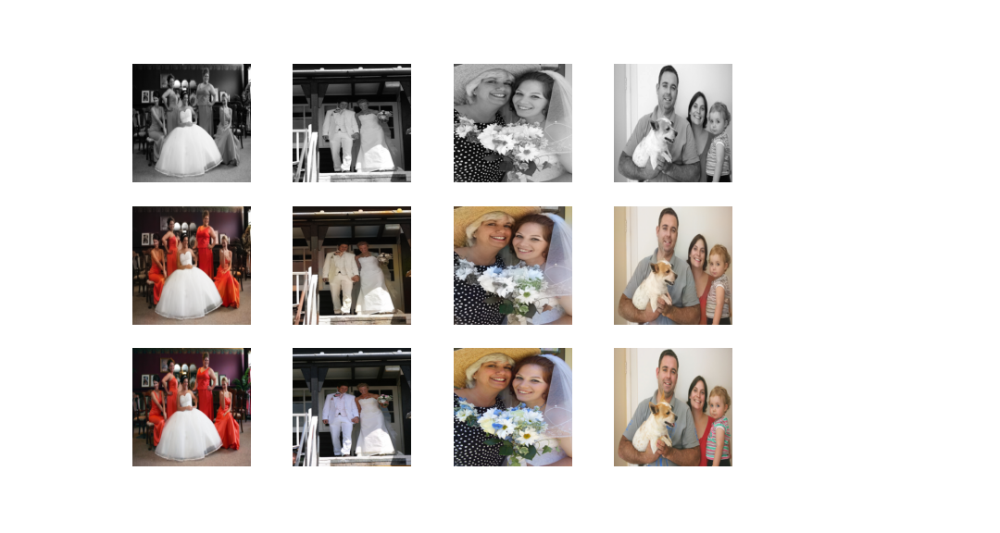
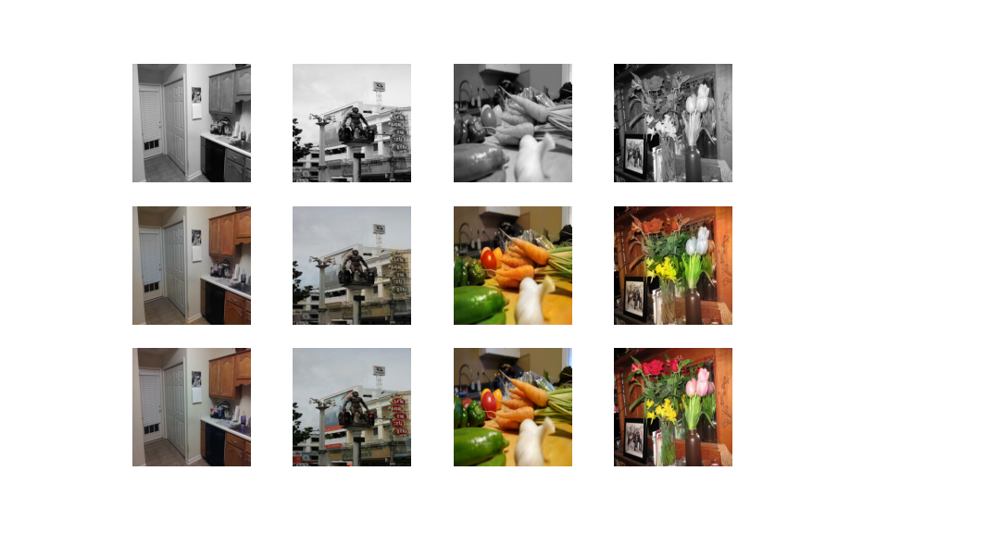

# Pix2Pix on Colorization

  English |
  <a href="README.md">Español</a>

PyTorch implementation of a Conditional Adversarial Network (cGAN) for Image-to-Image Translation applied to the task of image colorization.

The following implementations have been used as reference:

-  [Pix2Pix Implementation on PyTorch. 2018](https://github.com/eriklindernoren/PyTorch-GAN/blob/master/implementations/pix2pix/pix2pix.py)
-  [Colorizing B&W Images with U-Net and conditional GAN. Moein Shariatnia. 2020](https://github.com/eriklindernoren/PyTorch-GAN/blob/master/implementations/pix2pix/pix2pix.py)

## Datasets

The network has been trained with 2 separate datasets:
-   [Images of Groups](http://chenlab.ece.cornell.edu/people/Andy/ImagesOfGroups.html): Color images of group portraits taken at weddings and other formal social events. As there are fewer samples the network can achieve acceptable results in less time but generalizes worse. Suitable for old family photos.
    -   4946 samples in total (4900 for training)
-   [COCO](https://cocodataset.org/#overview): Varied color images. [COCO Train 2017](http://images.cocodataset.org/zips/train2017.zip) subset. As there are more samples and they are more diverse, the network generalizes better but it takes much longer to reach acceptable results and worse results are obtained for family portraits. Suitable for old photos featuring animals, vehicles or other classes included in the COCO dataset.
    -   7750 samples in total (7700 for training)

The grayscale images present in each dataset were removed during preprocessing.

## Preprocessing

Before entering the network, the images are resized to 256x256, normalized and converted to Lab color space.

The real luminance channel (L) will be used as input to the generator and the discriminator.

The real color channels (ab) will be used to calculate the error with respect to the output obtained by the generator.

The data generator in charge of providing each batch performs the following tasks:

1.  Read the RGB images from memory.

2.  Randomly flip horizontally (data augmentation).

3.  Convert the image from RGB to Lab.

4.  Normalize the L-channel values from \[0,100\] to \[0,1\].

5.  Normalize the values of the ab channels from \[-128,128\] to \[-1,1\].

6.  Convert the numpy matrix to PyTorch tensor (whc -> cwh). 

7.  Separate luminance (L) and color (ab) channels.

## Model

### Discriminator

The discriminator is a [PatchGAN](https://paperswithcode.com/method/patchgan) where the output is a 1-filter, 15x15-dimensional convolutional layer that indicates how real each patch or section of the image is.

The loss function of the discriminator is cross-entropy with logits (BCEWithLogitsLoss).

### Generator

The generator is a U-Net where the encoder is a ResNet18 pre-trained with ImageNet (U-ResNet). The [FastAI](https://docs.fast.ai/) library has been used to implement this network.

The loss function used is the mean absolute error (MAE or L1 loss) between the ab channels produced by the generator and the ab channels of the image whose L channel was passed as input to the generator.

## Training

For both the discriminator and the generator we use Adam optimizer with the same parameters.

To make the GAN training more stable we start with a generator that is reasonably good at coloring images from the first epoch.

To do this, we first pre-train the generator in isolation for 20 epochs. After the pre-training, the generator will be able to color images.

Then, we jointly train the generator and the discriminator for 100 epochs.

## Results

For both datasets, good results are obtained for the test samples. 

However, all images used for training, for both datasets, are sharp images without cracks or other damage present in older images. When a bad image is passed to it, the network is not able to color it correctly.

This can be fixed by adding artificial stripes and artifacts to the L layer of the images during training, modifying the generator to produce also the L channel and using the 3 channels in the L1 Loss. This way the network would be able to colorize and also fix damaged old photos.

Finally, even better results can be obtained by using a larger number of training samples and training for more epochs, especially for the COCO dataset.

### Images of Groups

### COCO

# Licencia

[MIT](LICENSE)
